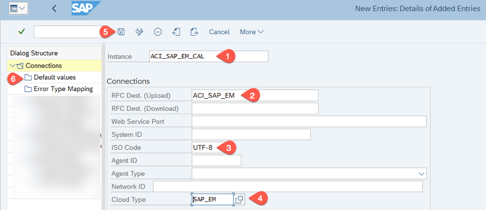
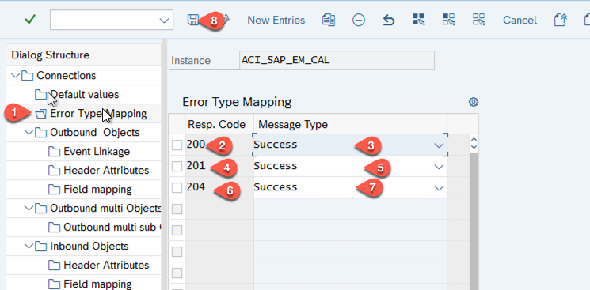
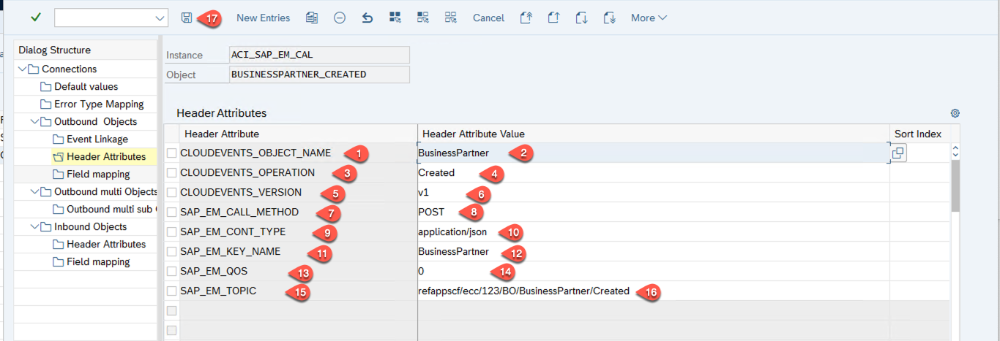

# Create Add-on Instance

You have done the basic connection and configuration steps for the eventing process. in this chapter you define the  
 
**Persona:** Basis ABAP Administrator 

### Connection Customizing File Transfer		
1. Go back to transaction **/nSPRO**, expand **SAP Customization Implementation Guide** --> **Integration with other SAP components** --> **SAP NetWeaver AddOn for Event enablement**  and choose the clock icon with tooltip **IMG:Activity** next to **Connection and Replication Object Customizing**.
   
   
   
2. Select **New Entries**.

   
   
3. In the screen **New Entries: Details of added entries** enter the following values: 
   - Enter instance name as **ACI_SAP_EM_CAL**
   - Enter/select RFC Destination(upload) **ACI_SAP_EM**
   - Enter/Select ISO code as **UTF-8**
   - Enter/Select Cloud Type **SAP_EM**
   - Press **Save** 
   - Select **Default Values**.
   
     
   
4. In **Default Values**, choose **New Entries**

   
   

5. In the opened screen, **New Entries: Overview of Added Entries**, enter the following values: 
   - In the column **Default Attribute**, enter **SAP_EM_CLIENT_ID**
   - For the **Default Attribute value**, copy and paste the value of **clientid** from the Event Mesh Service Key which you copied in the beginning of this document.
   - In the colum **Default Attribute**, enter **SAP_EM_TOKEN_DESTINATION**  
   - For this **Default Attribute value**, enter  **ACI_SAP_EM_TOKEN**
   - Select **Save**
   

     
   
6. In the **Dialog Structure** select **Error Type Mapping**, in the screen **Change View Error Type Mapping: Overview** click on **New Entries**.
   
7. In the opened screen, **Change View Error Type Mapping: Overview**, enter the following values: 
   - In the column **Resp Code**, enter **200**.
   - In the column **Message Type**, select **Success**
   - In the column **Resp Code**, enter **201**
   - In the column **Message Type**, select **Success**
   - In the column **Resp Code**, enter **204**
   - In the column **Message Type**, select **Success**
   - Click on **Save** icon.

     

8. Click **Outbound Objects** and Click **New Entries**

   
   
9. In the opened screen, **Change View Outbound Objects: Details**, enter the following values:
   - Enter Object as **BUSINESSPARTNER_CREATED**
   - Enter Extraction Function Module Name **/ASADEV/ACI_SIMPLE_NOTIFY**
   - Enter Message Type as **Z_ACI_MSG_CREATE**
   - Select Load Type as **Incremental Load**
   - Enter Event **API**
   - Check the **Trace** Checkbox	
   - Enter **Formatting Function**, value as **/ASADEV/ACI_SAP_EM_CLOUDEV_FM** 
   - Press **Save**
   	
     

10. Click **Header Attributes**, choose **New Entries**.
    
    
	
11. In the opened screen, enter the following values:
    - In the column, **Header Attributes**, enter **CLOUDEVENTS_OBJECT_NAME**
    - In the column, **Header Attributes Value**, enter **BusinessPartner**
    - In the column, **Header Attributes**, enter **CLOUDEVENTS_OPERATION**
    - In the column, **Header Attributes Value**, enter **Created**
    - In the column, **Header Attributes**, enter **CLOUDEVENTS_VERSION**
    - In the column, **Header Attributes Value**, enter **v1**
    - In the column, **Header Attributes**, enter **SAP_EM_CALL_METHOD**
    - In the column, **Header Attributes Value**, enter **POST**
    - In the column, **Header Attributes**, enter **SAP_EM_CONT_TYPE**
    - In the column, **Header Attributes Value**, enter **application/json**
    - In the column, **Header Attributes**, enter **SAP_EM_KEY_NAME**
    - In the column, **Header Attributes Value**, enter **BusinessPartner**
    - In the column, **Header Attributes**, enter **SAP_EM_QOS**
    - In the column, **Header Attributes Value**, enter **0**
    - In the column, **Header Attributes**, enter **SAP_EM_TOPIC**
    - In the column, **Header Attributes Value**, enter **refappscf/ecc/123/BO/BusinessPartner/Created** (enter the topic name created in Event Mesh Dashboard through CAP Application)
    - Press **Save**
    
      

12. Select **Event Linkage** and verifiy the values from transaction SWE2:
       
      - In the column, **Object Category** = **BOR Object Type**
      - In the column, **Object Type** = **BUS1006**
      - In the column, **Event** = **CREATED**
      - In the column, **Receiver Function Module** = **/ASADEV/ACI_EVENTS_TRIGGER**
      - The field **Global** is checked
      - The field **Type linkage active** is checked
      
      
      

13. Now, double click on **Outbound Object** and click **New Entries**.
14. In the opened screen, **Change View Outbound Objects: Details**, enter the following values:
   - Enter Object as **BUSINESSPARTNER_CHANGED**
   - Enter Extraction Function Module Name as **/ASADEV/ACI_SIMPLE_NOTIFY**
   - Enter Message Type as **Z_ACI_MSG_CHANGED**
   - Select Load Type as **Incremental Load**
   - Enter Event **API**
   - Check the **Trace** Checkbox	
   - Enter **Formatting Function**, value as **/ASADEV/ACI_SAP_EM_CLOUDEV_FM** 
   - Press **Save**
   	
     

15. Select **Header Attributes**, select **New Entries**.
16. In the opened screen, enter the following values:
    - In the column, **Header Attributes**, enter **CLOUDEVENTS_OBJECT_NAME**
    - In the column, **Header Attributes Value**, enter **BusinessPartner**
    - In the column, **Header Attributes**, enter **CLOUDEVENTS_OPERATION**
    - In the column, **Header Attributes Value**, enter **Changed**
    - In the column, **Header Attributes**, enter **CLOUDEVENTS_VERSION**
    - In the column, **Header Attributes Value**, enter **v1**
    - In the column, **Header Attributes**, enter **SAP_EM_CALL_METHOD**
    - In the column, **Header Attributes Value**, enter **POST**
    - In the column, **Header Attributes**, enter **SAP_EM_CONT_TYPE**
    - In the column, **Header Attributes Value** enter **application/json**
    - In the column, **Header Attributes**, enter **SAP_EM_KEY_NAME**
    - In the column, **Header Attributes Value**, enter **BusinessPartner**
    - In the column, **Header Attributes**, enter **SAP_EM_QOS**
    - In the column, **Header Attributes Value**, enter **0**
    - In the column, **Header Attributes**, enter **SAP_EM_TOPIC**
    - In the column, **Header Attributes Value**, enter **refappscf/ecc/123/BO/BusinessPartner/Changed** (enter the topic name created in Event Mesh Dashboard through CAP Application)
    - Press **Save**
    
      

17. Select **Event Linkage** and verifiy the values from transaction SWE2:
       
      - In the column, **Object Category** = **BOR Object Type**
      - In the column, **Object Type** = **BUS1006**
      - In the column, **Event** = **CHANGED**
      - In the column, **Receiver Function Module** = **/ASADEV/ACI_EVENTS_TRIGGER**
      - The field **Global** is checked
      - The field **Type linkage active** is checked
     
      

### Enter Cloud Connection Secret

1. Select the **Back** button to go to previous screen of **Display IMG**.
2. Expand the following path: **SAP Customization Implementation Guide** --> **Integration with Other SAP components** --> **SAP NetWeaver AddOn for Event Enablement** and click on clock icon with tooltip **IMG:Activity** next to **Set the Cloud Connection Password**.
3. In the screen, **Maintain the Cloud Shared Secret**:
   - Select Cloud Instance **ACI_SAP_EM_CAL**.
   - For the field **Cloud Shared Secret**, copy and paste the value of **clientsecret** from the Event Mesh Service Key which you copied in the beginning of this document.

     

   - Choose **Execute** ( You will see a success Message---> **Shared Secret for ACI_SAP_EM_CAL was created successfully!**)
   	
     
 

## Summary

You have estabilished a trust between our SAP ERP backend and the Event Mesh service and set up the eventing. Now you are ready to run the reference application and test your setup.

**Additional Resources:**

* [SAP Event Mesh for SAP ERP: HowTo-Guide (Part 1 – Connectivity)](https://blogs.sap.com/2020/10/02/sap-enterprise-messaging-for-sap-erp-howto-guide-part-1-connectivity/)

* [SAP Event Mesh for SAP ERP: HowTo-Guide (Part 2 – First use case)](https://blogs.sap.com/2020/10/08/sap-enterprise-messaging-for-sap-erp-howto-guide-part-2-first-use-case/)
* [SAP Help - SAP NetWeaver Add-On for Event enablement](https://help.sap.com/viewer/e966e6c0e61443ebaa0270a4bae4b363/1.0/en-US/3eba827c531344eb879d8e35022d90ba.html)
