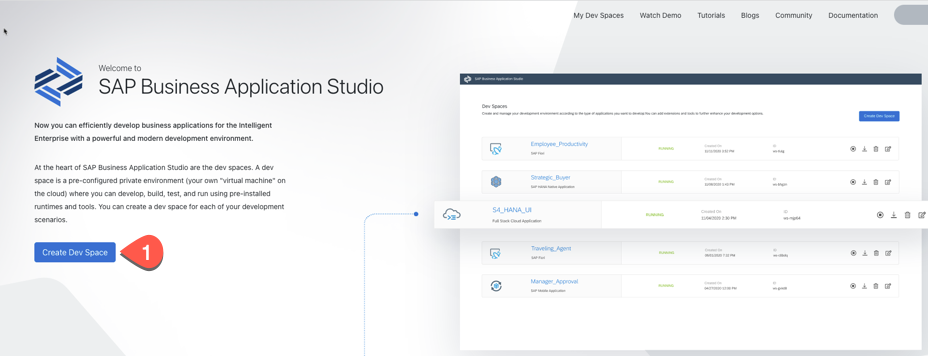
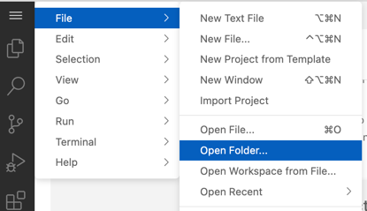

# Set Up the SAP Cloud Application Programming Model Application

## Introduction

In this section you will configure the reference application, create the necessary service instances for the SAP HANA database, SAP Event Mesh, security and connectivity. You will also deploy the application to your subaccount in SAP Business Technology Platform (SAP BTP) and run a first test.
 
The application structure is based on the SAP Cloud Application Programming Model.
If you want to know how to build such an application from scratch, please check the [SAP Cloud Application Programming Model documentation](https://cap.cloud.sap/docs/) or take a look at [Mission: Extend SAP S/4HANA On Premise business processes on SAP BTP](https://platformx-ad17b8dc3.dispatcher.hana.ondemand.com/protected/index.html#/missiondetail/3242/3268) where the local development part is described.

The SAP Cloud Application Programming Model project contains the following files folders:

File / Folder | Purpose
---------|----------
`app/` | Contains content for the UI frontend (SAP Fiori elements)
`db/` | Contains your domain CDS models and data
`srv/` | Contains your service models and code
`srv/external` | Contains the reference to the external Business Partner service
`srv/external/data` | Contains some sample data for the demo application
`srv/service.js` | Contains the implementation of the service model 
`package.json` | Contains the project metadata and configuration
`em.json` | Contains the configuration file for the SAP Event Mesh service
`xs-security.json` | Contains the configuration file for the SAP Authorization and Trust Management service
`mta.yaml` | Contains the multitarget application build file


**Audience:** Cloud Application Developer

## Step-by-Step

### Create a New Application in SAP Business Application Studio

1.	Log in to the SAP BTP cockpit and navigate to your subaccount.
   
2.	Choose **Instances and Subscriptions**. In the **Subscriptions** section, choose **Business Application Studio**, and then choose **Go to Application**.

    
   
3.	Open the application **SAP Business Application Studio** and log in using your username and password.

     
 
4.	In the SAP Business Application Studio, choose **Create Dev Space**.

    
   
   If you already have a Dev space, you will see the following screenshot, click *Create Dev Space*.
  
   
 
5.	On the next screen, enter a Dev space name, for example **mission**, and select the **Full Stack Cloud Application** type. Choose **Launchpad Module** in the **Additional SAP Extensions** and Choose **Create Dev Space**.

      
      
 
6.	Your Dev Space is now being created. As soon as the Dev Space is available, you can choose your Dev Space's name to access it.

7.	Choose **Terminal** > **New Terminal** in the menu on the top of your screen.

    
 
8. Go to projects folder.

   ```bash
   cd projects
   ``` 
 
9. Clone the project from the SAP samples application repository. When you are working with SAP ERP 6.0 (ECC) as a backend system, use the main branch and use the following command:

    ```bash
    git clone https://github.com/SAP-samples/cloud-extension-ecc-business-process.git
    ```
    
    When you are working with SAP S/4HANA as a backend system then the sample code is in branch **s4h-addon** and use the following command:

    ```bash
    git clone -b s4h-addon https://github.com/SAP-samples/cloud-extension-ecc-business-process.git
    ```
 
10. Choose **File** in the menu on the top and then select **Open Workspace** from the dropdown menu.

    
 
11.	 Open the project by choosing **projects** > **cloud-extension-ecc-business-process** and choose **Open**.
 

12.  Next you need to login to your Cloud Foundry account from SAP Business Application Studio:
 
   * Check if you are logged in to your account in SAP BTP from **SAP Business Application Studio**.
     
   * To log in to Cloud Foundry, choose **View** > **Find Command**.
    
   * Search for **CF Login**.
    
   * Choose **CF: Login on to Cloud Foundry**.

      
    
   * Enter CF API endpoint or take the default suggested API endpoint. You can find the API endpoint of your region by switching into your subaccount in the SAP BTP cockpit that you should have opened in another browser tab and copy the API Endpoint. Write down the **Org Name** into a text editor of your choice which is needed for the next step.  

     
    
   * Choose **Spaces** and write down the space name to a text editor of your choice. 

     
     
   * Enter **Email** and **Password** when prompted.
   * Select your Cloud Foundry **Org** which you have noted down in the previous step. 
   * Select the space name which you have noted down. Once you have selected the Org and Space, log in to your Cloud Foundry account from SAP Business Application Studio.


13. For the next steps you need the terminal again. Choose **Terminal** > **New Terminal**.
    - Create a hdi-shared database instance. To do that, you need the guid of the SAP HANA Cloud service that you have created at the [SAP BTP Setup](../scp-setup/README.md). You can find the service name in the list of services.
      
	 ```bash
		 cf services    
		    
		 cf service <HANA Service > --guid
	```

    With the guid we can create a hdi-shared database instance:
       
    ```bash
       cf cs hana hdi-shared BusinessPartnerValidation-db -c '{"database_id" : "<guid of HANA Service>"}'
    ```   
            
   
    - In the next step, you will create a number of service instances such as SAP Connectivity and SAP Event Mesh services. You will do this by executing the following Cloud Foundry create service instance commands.
    

   
      * Create enterprise-messaging instance using the em.json configuration file in your project.
     
        ```bash
         cf cs enterprise-messaging default BusinessPartnerValidation-ems -c em.json
        ```
        
        > When you are using **SAP BTP trial** then you have to use the dev service plan. The em.json file should have the following parameters to work with the SAP Event Mesh service (dev plan). Change "\<emname\> to a meaningful value, for example, eccevent.
        >   ```json
        >   { "emname": "<emname>",
        >     "options": {
        >       "management": true,
        >       "messagingrest": true,
        >       "messaging": true
        >   }
        > }
        > ```
        >
        >```bash
        >   cf cs enterprise-messaging dev BusinessPartnerValidation-ems -c em.json
        
        > **SAP BTP Trial only:** Open srv >service.js file and search for messaging.on. Replace the topic name (refappscf/ecc/123/BO/BusinessPartner/Changed) with the customized one.
        > Ex:- \<emname\>/BO/BusinessPartner/Created and \<emname\>/BO/BusinessPartner/Changed
        
        > **SAP BTP Trial only:** In the mta.yml file, change the service plan name to dev for BusinessPartnerValidation-ems
        >```
        >  - name: BusinessPartnerValidation-ems
        >    parameters:
        >    path: ./em.json 
        >    service: enterprise-messaging
        >    service-plan: default
        > type: org.cloudfoundry.managed-service 
        > ```

      * Create a Destination service instance
  
        ```bash
        cf cs destination lite BusinessPartnerValidation-dest
        ```

      * Create an SAP Authorization and Trust Management service instance using the xs-security.json configuration file in your project.
    
        ```bash
        cf cs xsuaa application BusinessPartnerValidation-xsuaa -c xs-security.json
        ```    

      * Create an SAP Connectivity service instance for accessing the Cloud Connector.  
 
        ```bash
        cf cs connectivity lite BusinessPartnerValidation-cs        
        ```

      * Generate a service key that you will need later for binding service intances.
   
        ```bash
         cf create-service-key BusinessPartnerValidation-ems emkey
        ```

      * Build the application.
    
        ```bash
        cds build --production
        ```


    
14. Open the gen/srv/manifest.yaml file and add your service names / replace existing ones with your services: ems, dest, xsuaa, database.  
Set the Memory to 256MB.

    > Hint: To make sure that the services names match, execute the CF command **cf services** which lists the services you have created including their names.

    
 
15. Go back to the terminal and run following commands:

    ```bash
       //generate the database instance deploy the database content
       cf p -f gen/db
       
       //generate the service instances and deploy the service
       cf p -f gen/srv --random-route
    ```
 
16. Generate the MTAR file. Alternatively, you can also right-click on **mta.yaml **file in the Explorer view and select **Build MTA Project** to build the project.
    
    ```bash
      mbt build -p=cf
    ```

17. Deploy the application to your Cloud Foundry space with the MTAR. Alternatively, You can expand the folder **mta\_archives** in Explorer view and right-click on file **BusinessPartnerValidation\_1.0.0.mtar** and choose **Deploy MTA Archive**.

    ```bash
    cf deploy mta_archives/BusinessPartnerValidation_1.0.0.mtar
    ```
    
18. Check if the deployment finished successfully without giving any errors.

### Test your application

1. Go to the terminal and enter *cf apps*.

 


2. Copy the URL of the app BusinessPartnerValidation-srv and open it in a new browser tab.

 

3. You can see that the service is deployed and is running. You cannot test or access the data and you will get authorization error (which is fine).

 ## Summary

 You have done the configuration for the reference application. You also created the service instances for the required services and deployed the application to your Cloud Foundry space in SAP BTP. In the next steps, you will configure the eventing on the cloud and on-premise and then you are ready to run the application.


