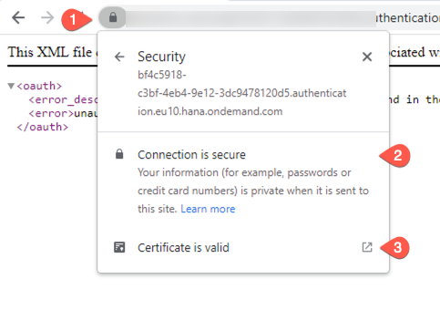
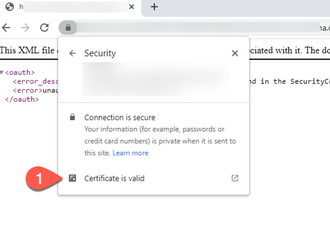
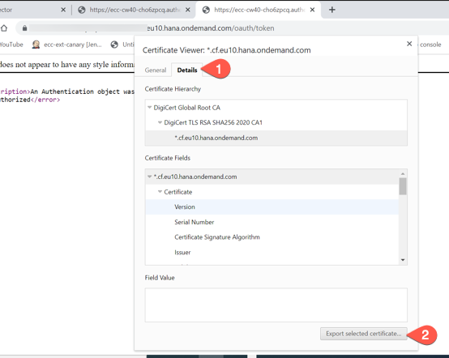
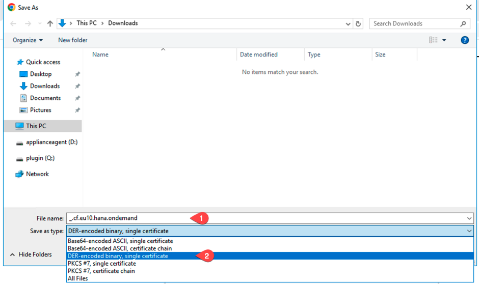
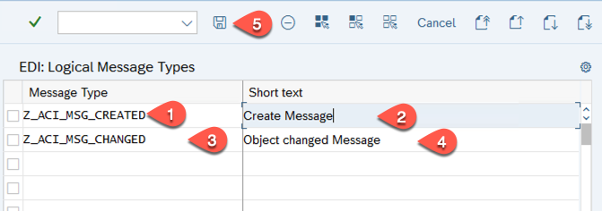
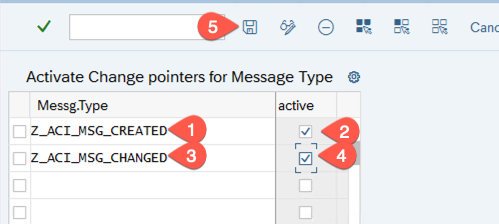
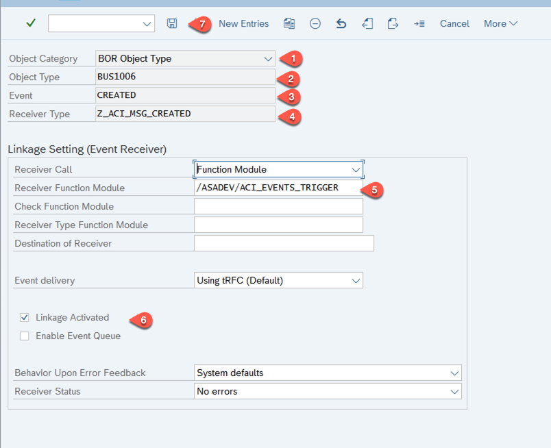
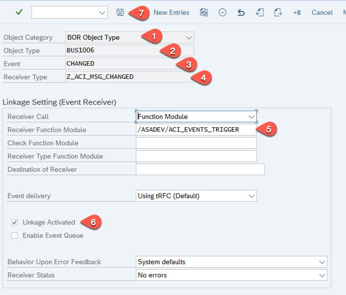
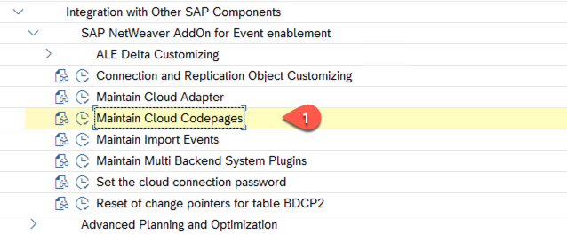
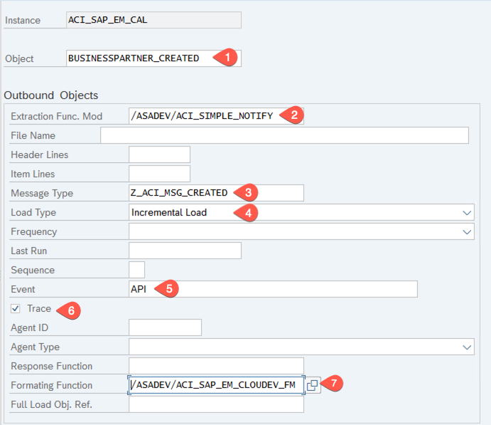

# Configuration of Eventing in on-premise backend and Event Mesh

## Introduction

In this section, we describe steps how to configure your on-premise backend system to use the SAP NetWeaver Add-On for Event enablement Service Pack SP03. If you have installed only Service Pack SP01 or SP02 please use the [SP01 Setup Guide](./SETUP_SP01.md). In SP03 the setup has been simplified and the events are now compatible to standard SAP S/4HANA events.

**Persona:** Basis ABAP Administrator 

## Step-by-Step

### Requirements

- A working instance of Event Mesh.

### Download Event Mesh Certificate 

1. Login to your SAP Business Technology Platform (BTP) account.
2. Navigate to your Subaccount -> Services and click **Service Instances**.
3. Select your already created Event Mesh instance and view the Service key. Also copy this Service Key to a text editor of your choice.
   
   
   
4. Copy the Event Mesh Token Endpoint URL and open this URL in a browser of your choice. Here the following screenshots are shown with Internet Explorer and might differ for other browsers.
   
   
   
5. Once you open the Token Endpoint URL, select **Cancel** in the popup and choose the view site information button (lock symbol on top left corner). Select **Connection is secure**.

   
   
6. Choose **Certificate is valid**
   
   
   

7. Select **Details** and choose **Copy to files**.

   
   
8. Now **Certificate Export Wizard** opens, select **Next**.

   
   
9.  Select the format as **DER encoded binary X.509 (.CER)** and choose **Next**.

    
    
10. Select a folder to export the certificate and choose **Next**.
   
   
   
11. Choose **Finish** to export the certificate. Now we have exported the Event Mesh certificate.

    
    
	
### Create a Node for standard SSL Client
1. Open your SAP backend system and go to transcaction - **/nSTRUST**. 
2. Select **Display/Change icon** and right click on **SSL client SSL Client (Standard) Node** and select **Create**.

   

3. A popup **Create PSE** will appear. Select **Continue(Enter)**.

   
 
 
 
### Import SAP Event Mesh certificate in on-premise system

1. Still in transaction - **/nSTRUST**. 	
2. Select **Display/Change icon** and right click on **SSL client SSL Client (Anonymous)  Node**, then select **Create**.

   
   
3. A Popup **Create PSE** will appear. Select **Continue(Enter)**.

   
   
4. Select **Import Certificate** (under **Certificate**).

    

5. Enter file path to certificate file which you have stored in your local system.
   
   
   
6. Select **Continue** and then **Allow** for the **SAP GUI Security** popup asking to allow access to the file. 
7. Now you can see the certificate as imported, choose **Add to Certificate List** and select the **Save** icon.
   
   >Hint: Note the valid-to date of the certificate and update it in advance.	
   
   

### Configure RFC Destinations

1. Enter Transaction **/nsm59**.	
2. Select **Create**.

   
   
3. Enter a destination name **ACI\_SAP\_EM** and select the connection type **G Http connection to External Server** from the popup which appears once you enter **G** in that field, select the **Save** icon.
   
    

4. Choose **Continue** for the popup that says information **HTTP Connections may not be secure**.
5. Switch to the text editor where you have copied the Service Key of Event Mesh in the first section above. Copy the value of **uri** for the protocol **httprest**
6. Switch back to the RFC Destination tab and for field **Target Host**, enter the uri which you copied excluding **https://** for example: enterprise-messaging-pubsub.cfapps.eu10.hana.ondemand.com. Select the **Save** icon and choose **Connection Test**.

   
   
7. Connection Test has to give a response of **Status HTTP Response** as **200** and **Status Text** as **Ok**. If not, check if the target host field is entered properly.

   
   
8. Choose back icon to create a second RFC Destionation.
9. Select the **Create** button like in step 2.
10. Enter a destination name **ACI\_SAP\_EM\_TOKEN** and choose connection type **G Http connection** from the drop down, select the **Save** icon.
   
    
   
11. Choose **Continue** for the popup that says information **HTTP Connections may not be secure**.
12. Switch to the text editor where you have copied the Service Key of Event Mesh in the first section above. Copy the value of **tokenendpoint** excluding **https://** and **oauth/token** from the URL.	
13. Switch back to the RFC Destination tab and for field **Target Host**, enter the copied URL for example: **xxxxxx.authentication.eu10.hana.ondemand.com**. Enter for field **Path Prefix** value as **/oauth/token**.

    

14. Choose tabulator **Logon & Security** and scroll-down to Security options and select the radio button **active** for field **SSL** and for field **SSL Certificate**, select **Anonym SSL Certificate (Anonymous)** from dropdown and **Save**.

    
    
15.Then choose **Connection Test**. Connection Test gives a response of **Status HTTP Response** as **401** and **Status Text** as **Unauthorized** which is fine. Select  **Cancel** as this is expected here.

   

### Configure Logical Message Types

WE81 (Logical message types) is a standard SAP parameter transaction code that is used to maintain the contents of VEDI\_EDMSG database table. It does this by executing the table maintenance t-code SM30 in edit mode, assuming you have the appropriate authorisations.

1. Click on back icon to goto the home screen and enter transaction **/nWE81** and click on **Display/Change**. For the warning that change is cross-client, click **Ok**.

    
    
2. Click on field **New Entries**.
3. Add the following two Message types,
   - Enter Message Type: **Z\_ACI\_MSG\_CREATE**
   - Enter Any Meanigful for field **Short Text**
   - Add another Message Type: **Z\_ACI\_MSG\_CHANGED**
   - Enter Any Meanigful **Short Text**	
   - Click on **Save**

   	

4. When you try to Save, it prompts to create a Transport Request for any Cross Object. Click **Create** icon to create a new Workbench request.

   

5. Enter some meaningful text for the field **Short Description** and click on **Save**.

   

5. Click the **Green tick mark** icon in the screen to save the Object in Transport. Once Transport is created, for any further cross object changes, you can capture the change in the same transport number/Request which you have created now. You will be prompted with similar "Transport Request"/ "Customizing Request" in the next steps, you can reuse the same Transport request which you created now.

   
   

### Activate Change Pointers for Message Types		
1. Enter Transaction **/nBD50**.
2. Click on **New Entries**.

   

3. Add the following 2 change pointers for message types:
   - Add Message Type **Z\_ACI\_MSG\_CREATE**
   - Click the checkbox as **Active** next to the message type
   - Add second Message Type **Z\_ACI\_MSG\_CHANGED**
   - Click the checkbox as **Active** next to also this message type
   - Click **Save** icon.
   
   
   
4. For the screen with **Prompt with Customization Request**, you have to create a new transport request and then choose **Ok** to save.
 
   

### Maintain Event Type Linkage 

1. Enter the Transaction **/nSWE2** and select **New Entries**.
   
     
  
   We now map the BusinessObjects events:
   
2. In the opened screen, enter the following values:
   - For field **Object Category**, select **BOR Object Type**
   - For field **Object Type**, select **BUS1006**
   - For field **Event**, select **CREATED**
   - For field **Receiver type**, select **Z\_ACI\_MSG\_CREATE**
   - For field **Receiver Function Module**, select **/ASADEV/ACI\_EVENTS\_TRIGGER**
   - Check the checkbox **Linkage Activated**
   - Click **Save** icon
        
     
     
3. Click **New Entries**
4. In the opened screen, enter the following values:
   - For field **Object Category**, select **BOR Object Type**
   - For field **Object Type**, select **BUS1006**
   - For field **Event**, select **CHANGED**
   - For field **Receiver type**, select **Z\_ACI\_MSG\_CHANGED**
   - For field **Receiver Function Module**, select **/ASADEV/ACI\_EVENTS\_TRIGGER**
   - Check the checkbox **Linkage Activated**
   - Click **Save** icon and then the **OK** (green-tick) icon for Transport Request.
        
     

### Set ISO standard with UTF-8

1. Enter Transaction **/nSPRO** and select the **SAP Reference IMG** icon.

   
   
2. Expand **SAP Customization Implementation Guide** --> **Integration with Other SAP components** --> **SAP NetWeaver AddOn for Event enablement** and choose the clock icon with tooltip **IMG:Activity** next to **Maintain Cloud Codepages**.	
   
   
3. Select **Display/Change** icon and choose **New Entries**.

   
   
4. Enter in the field **ISO** value as **UTF-8** and for the field **Code Page**, enter **4110** and select the **Save** icon and then the **OK** (green-tick) icon for Transport Request.

   
   
5. Enter **Back** button to go to previous screen.

### Load Events into Cloud

1. Expand **SAP Customization Implementation Guide** --> **Integration with Other SAP components** --> **SAP NetWeaver AddOn for Event enablement** --> and click on the clock icon with tooltip **IMG:Activity** next to **Maintain Import Events**. 

   
   
2. Click on **Display/Change** icon and click on **New Entries**.

   
   
4. Enter in the field **Import Event** value as **API** and click **Save** icon and then the **OK** (green-tick) icon for Transport Request.

   
   
5. Click on **Back** Button to go to previous screen.

### Connection Customizing File Transfer		
1. Go back to transaction **/nSPRO**, expand **SAP Customization Implementation Guide** --> **Integration with other SAP components** --> **SAP NetWeaver AddOn for Event enablement**  and choose the clock icon with tooltip **IMG:Activity** next to **Connection and Replication Object Customizing**.
   
   
   
2. Select **New Entries**.

   
   
3. In the screen **New Entries: Details of added entries** enter the following values: 
   - Enter instance name as **ACI\_SAP\_EM\_CAL**
   - Enter/select RFC Destination(upload) **ACI\_SAP\_EM**
   - Enter/Select ISO code as **UTF-8**
   - Enter/Select Cloud Type **SAP\_EM**
   - Press **Save** 
   - Select **Default Values**.
   
     
   
4. In **Default Values**, choose **New Entries**

   
   

5. In the opened screen, **New Entries: Overview of Added Entries**, enter the following values: 
   - In the column **Default Attribute**, enter **SAP\_EM\_CLIENT\_ID**
   - For the **Default Attribute value**, copy and paste the value of **clientid** from the Event Mesh Service Key which you copied in the beginning of this document.
   - In the colum **Default Attribute**, enter **SAP\_EM\_TOKEN\_DESTINATION**  
   - For this **Default Attribute value**, enter  **ACI\_SAP\_EM\_TOKEN**
   - Select **Save**
   

     
   
6. In the **Dialog Structure** select **Error Type Mapping**, in the screen **Change View Error Type Mapping: Overview** click on **New Entries**.
   
7. In the opened screen, **Change View Error Type Mapping: Overview**, enter the following values: 
   - In the column **Resp Code**, enter **200**.
   - In the column **Message Type**, select **Success**
   - In the column **Resp Code**, enter **201**
   - In the column **Message Type**, select **Success**
   - In the column **Resp Code**, enter **204**
   - In the column **Message Type**, select **Success**
   - Click on **Save** icon.

     

8. Click **Outbound Objects** and Click **New Entries**

   
   
9. In the opened screen, **Change View Outbound Objects: Details**, enter the following values:
   - Enter Object as **BUSINESSPARTNER\_CREATED**
   - Enter Extraction Function Module Name **/ASADEV/ACI\_SIMPLE\_NOTIFY**
   - Enter Message Type as **Z\_ACI\_MSG\_CREATE**
   - Select Load Type as **Incremental Load**
   - Enter Event **API**
   - Check the **Trace** Checkbox	
   - Enter **Formatting Function**, value as **/ASADEV/ACI\_SAP\_EM\_CLOUDEV\_FM** 
   - Press **Save**.
   	
     

10. Click **Header Attributes**, choose **New Entries**.
    
    
	
11. In the opened screen, enter the following values:
    - In the column, **Header Attributes**, enter **CLOUDEVENTS\_OBJECT\_NAME**
    - In the column, **Header Attributes Value**, enter **BusinessPartner**
    - In the column, **Header Attributes**, enter **CLOUDEVENTS\_OPERATION**
    - In the column, **Header Attributes Value**, enter **Created**
    - In the column, **Header Attributes**, enter **CLOUDEVENTS\_VERSION**
    - In the column, **Header Attributes Value**, enter **v1**
    - In the column, **Header Attributes**, enter **SAP\_EM\_CALL\_METHOD**
    - In the column, **Header Attributes Value**, enter **POST**
    - In the column, **Header Attributes**, enter **SAP\_EM\_CONT\_TYPE**
    - In the column, **Header Attributes Value**, enter **application/json**
    - In the column, **Header Attributes**, enter **SAP\_EM\_KEY\_NAME**
    - In the column, **Header Attributes Value**, enter **BusinessPartner**
    - In the column, **Header Attributes**, enter **SAP\_EM\_QOS**
    - In the column, **Header Attributes Value**, enter **0**
    - In the column, **Header Attributes**, enter **SAP\_EM\_TOPIC**
    - In the column, **Header Attributes Value**, enter **refappscf/ecc/123/BO/BusinessPartner/Created** (enter the topic name created in Event Mesh Dashboard through CAP Application)
    - Press **Save**
    
      

12. Select **Event Linkage** and verifiy the values from transaction SWE2:
       
      - In the column, **Object Category** = **BOR Object Type**
      - In the column, **Object Type** = **BUS1006**
      - In the column, **Event** = **CREATED**
      - In the column, **Receiver Function Module** = **/ASADEV/ACI\_EVENTS\_TRIGGER**
      - The field **Global** is checked
      - The field **Type linkage active** is checked
      
      
      

13. Now, double-click on **Outbound Object** and select **New Entries**.
14. In the opened screen, **Change View Outbound Objects: Details**, enter the following values:
   - Enter Object as **BUSINESSPARTNER\_CHANGED**
   - Enter Extraction Function Module Name as **/ASADEV/ACI\_SIMPLE\_NOTIFY**
   - Enter Message Type as **Z\_ACI\_MSG\_CHANGED**
   - Select Load Type as **Incremental Load**
   - Enter Event **API**
   - Check the **Trace** Checkbox	
   - Enter **Formatting Function**, value as **/ASADEV/ACI\_SAP\_EM\_CLOUDEV\_FM** 
   - Press **Save**.
   	
     

15. Select **Header Attributes**, select **New Entries**.
16. In the opened screen, enter the following values:
    - In the column, **Header Attributes**, enter **CLOUDEVENTS\_OBJECT\_NAME**
    - In the column, **Header Attributes Value**, enter **BusinessPartner**
    - In the column, **Header Attributes**, enter **CLOUDEVENTS\_OPERATION**
    - In the column, **Header Attributes Value**, enter **Changed**
    - In the column, **Header Attributes**, enter **CLOUDEVENTS\_VERSION**
    - In the column, **Header Attributes Value**, enter **v1**
    - In the column, **Header Attributes**, enter **SAP\_EM\_CALL\_METHOD**
    - In the column, **Header Attributes Value**, enter **POST**
    - In the column, **Header Attributes**, enter **SAP\_EM\_CONT\_TYPE**
    - In the column, **Header Attributes Value** enter **application/json**
    - In the column, **Header Attributes**, enter **SAP\_EM\_KEY\_NAME**
    - In the column, **Header Attributes Value**, enter **BusinessPartner**
    - In the column, **Header Attributes**, enter **SAP\_EM\_QOS**
    - In the column, **Header Attributes Value**, enter **0**
    - In the column, **Header Attributes**, enter **SAP\_EM\_TOPIC**
    - In the column, **Header Attributes Value**, enter **refappscf/ecc/123/BO/BusinessPartner/Changed** (enter the topic name created in Event Mesh Dashboard through CAP Application)
    - Press **Save**
    
      

17. Select **Event Linkage** and verifiy the values from transaction SWE2:
       
      - In the column, **Object Category** = **BOR Object Type**
      - In the column, **Object Type** = **BUS1006**
      - In the column, **Event** = **CHANGED**
      - In the column, **Receiver Function Module** = **/ASADEV/ACI\_EVENTS\_TRIGGER**
      - The field **Global** is checked
      - The field **Type linkage active** is checked
     
      

### Enter Cloud Connection Secret

1. Select the **Back** Button to go to previous screen of **Display IMG**.
2. Expand the following path: **SAP Customization Implementation Guide** --> **Integration with Other SAP components** --> **SAP NetWeaver AddOn for Event Enablement** and click on clock icon with tooltip **IMG:Activity** next to **Set the Cloud Connection Password**.
3. In the screen, **Maintain the Cloud Shared Secret**:
   - Select Cloud Instance **ACI\_SAP\_EM\_CAL**.
   - For the field **Cloud Shared Secret**, copy and paste the value of **clientsecret** from the Event Mesh Service Key which you copied in the beginning of this document.

     

   - Select **Execute** ( You will see a success Message---> **Shared Secret for ACI\_SAP\_EM\_CAL was created successfully!**)
   	
     
 
## Summary

We have established a trust between our SAP ERP backend and the Event Mesh service and set up the eventing. Now we are ready to run the reference application.

**Additional Resources:**

* [SAP Event Mesh for SAP ERP: HowTo-Guide (Part 1 – Connectivity)](https://blogs.sap.com/2020/10/02/sap-enterprise-messaging-for-sap-erp-howto-guide-part-1-connectivity/)

* [SAP Event Mesh for SAP ERP: HowTo-Guide (Part 2 – First use case)](https://blogs.sap.com/2020/10/08/sap-enterprise-messaging-for-sap-erp-howto-guide-part-2-first-use-case/)
* [SAP Help - SAP NetWeaver Add-On for Event enablement](https://help.sap.com/viewer/e966e6c0e61443ebaa0270a4bae4b363/1.0/en-US/3eba827c531344eb879d8e35022d90ba.html)

