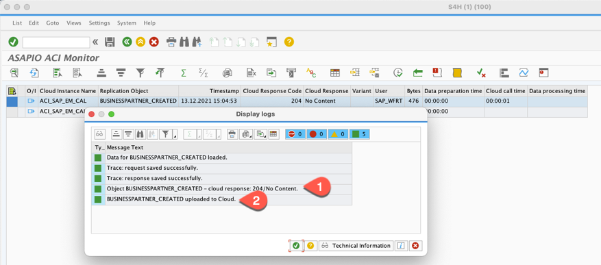
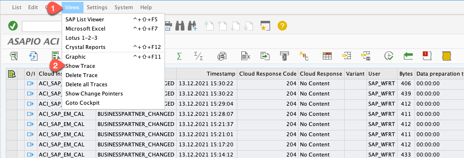
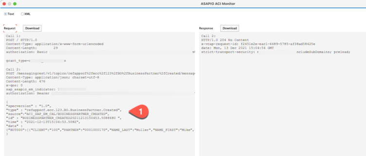

# Test the Business Scenario

Let us test the end-to-end cloud application and also understand the entire flow to verify the scenario. 

## Access Frontend Application

1. Go to your subaccount in SAP BTP cockpit and choose **Space**.

   

2. From your space, choose the tile of your application and then choose the link in the **Application Routes** section.

   

   

3. Start the Business Partner Validation application.

   

   

## Add New Business Partner in the Backend of the Application

1. Log in to your SAP S/4HANA system with **SAP Logon**

   

2. Go to transaction **bp**.

   

3. Create a new **Business Partner**.

    

    1. Add an address.

    

    2. Enter a full name.

    

    3 Enter a street, postal code, city and country.

    

    * Set the status to **Central Block** and choose **Save**.

    
    
## Check Custom Data Event for the New Business Partner

Let us first check in the SAP S/4HANA backend if the event was sent to the cloud.

1. Log in to your SAP S/4HANA system with **SAP Logon**.
2. Go to transaction **/n/asadev/aci_monitor**. Choose the **Execute** or **F8** icon.
3. You can see that the business partner was created and you have a response code of **204**. If you do not see a success response, see the troubleshooting section in the bottom of this page.
   
   
   
   Select the row of the business partner created event and choose **Open Application Log** icon as shown in screenshot above. You will see a pop-up window displaying logs.
    
   

4. Choose **Views** > **Show Trace**. 

   
   
5. You can view the trace of the new business partner created and the payload of the custom data event.

   
   
         

## Change a Field and Verify Business Partner in Frontend

1. Switch to your browser window where you have opened the link of the application. Check that the newly created business partner has appeared in the list of Business Partners with status **New**.

    

2. Choose the new business partner.

    

3. Choose **Edit**.

    

4.  Change the address, set the **Verification Status** to **Verified** and choose **Save**.

    

    

## Check Status of Business Partner in Backend

1. Go back to transaction **bp** in the SAP S/4HANA system.

    

2. Open the details of the business partner you have just set to **Verified**.

    

3. **Search Term** field will be set to **Verified** and **Address** field will also reflect updated field.

    

4. Go to the **Status** tab and check whether the **Central Block** flag has been removed.

    

5. Like mentioned in the steps above for checking logs/trace for create event, you can also the view the logs and trace in the SAP S/4HANA system using the transaction **/n/asadev/aci_monitor**. 
6. Choose **Views** >  **Show Trace**.

  

## Logs and Troubleshooting

- Additionally you can check the logs of SAP NetWeaver Add-On for Event enablement as described in the chapter [Monitoring and Logging](https://help.sap.com/viewer/e966e6c0e61443ebaa0270a4bae4b363/1.0/en-US/cff1acd831f744d59697525702ed0d3e.html).

- To monitor the Events from SAP ECC open Transaction **SLG1** on your backend.

    

    

- In transaction **SLG1**, you can even view the trace of an event by choosing **More > Views > Show Trace**.

    

    

- The regular SAP BTP logs might also be helpful. Access the corresponding **Space** in your **Subaccount**. Then choose your application and the choose **Logs**.

    

    

- If you get the following error in the demo application log, check the [Virus Scan setup](https://help.sap.com/doc/saphelp_nw751abap/7.51.0/en-US/b5/5d22518bc72214e10000000a44176d/frameset.htm) of your SAP ERP backend.
    
     

