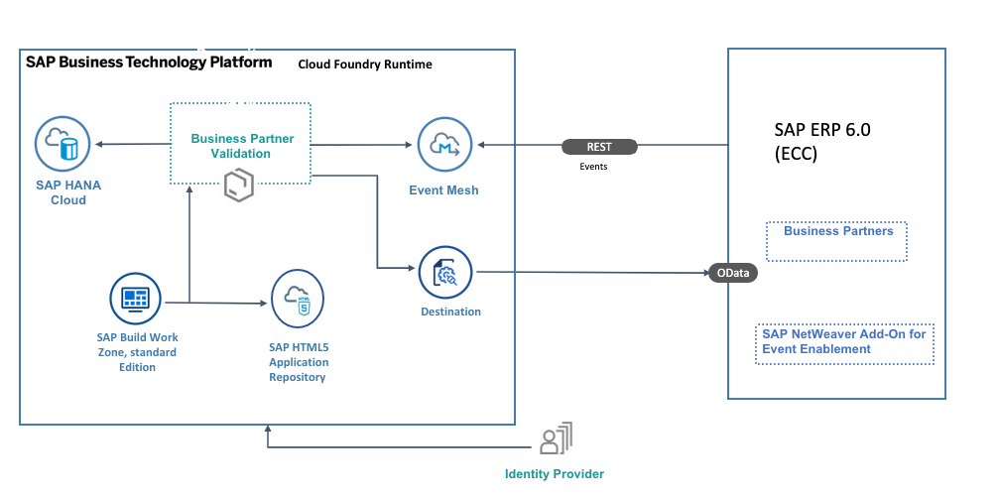
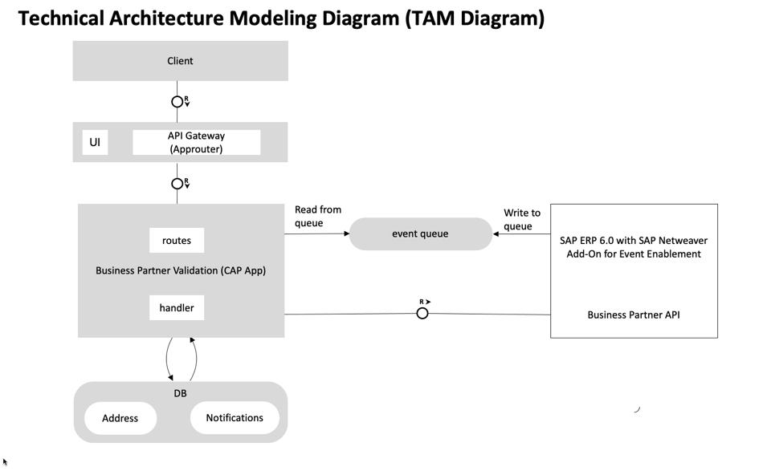

# SAP ERP 6.0 (ECC) Extend Business Process Scenario

## Description
The main intent of this scenario is to complement an existing business process in an SAP solution – currently, SAP ERP 6.0, SAP S/4HANA, SAP SuccessFactors or selected SAP Cloud solutions - with additional business process steps. This involves adding major logic and/or additional data and goes beyond simple UI changes.

This application showcases:

- Building application on SAP BTP using SAP Cloud Application Programming Model(CAP)
- Consuming Events from SAP ERP 6.0 on premise using SAP Event Mesh
- Consuming REST API's from SAP ERP 6.0 on premise using SAP CP Connectivity Service

## Business Scenario

A business scenario is used to showcase how to build a SAP ERP 6.0 on premise extension Application.

As an employee of Business Partner Validation Firm iCredible, which is a third party vendor of ACME Corporation, John would like to get notifications whenever new Business Partners are added in the SAP backend system of ACME Corporation. John would then be able to review the Business Partner details in his extension app. He would proceed to visit the Business Partner’s registered office and do some background verification. John would then proceed to update/validate the verification details into the extension app. Once the details are verified, the Business Partner gets activated in the SAP ERP system of ACME Corporation.

- Custom extension application that works independently from SAP ERP​
- Changes in ERP communicated via events in real time to extension application.​
- Vendor personnel needs access to only custom app

## Persona
For the complete installation, configuration and implementation of this scenario at least the following persona are involved:

* **ERP and Backend Administrator**
* **ABAP Developer**
* **SAP BTP Administrator**
* **Cloud Application Developer**

## Architecture

### Solution Diagram

  

The Business Partner Validation application is developed using [SAP Cloud Application programming Model (CAP)](https://cap.cloud.sap/docs/) and runs on the SAP BTP Cloud Foundry Environment. It consist of 3 modules: database, service and UI. It consumes platform services like Event Mesh, SAP HANA and Connectivity. The events generated in the SAP ERP system are inserted into the Event Mesh queue. The application running in Cloud Foundry polls the queue for these messages and inserts them into the HANA database. The Business Partner Validation Application uses custom OData services to read data from Business Partner Data from SAP ERP system - thoses services uses the S/4HANA APIs as a template. 

   

## Requirements
* SAP ERP 6.0 on premise system with Netweaver 7.31 or later  - in this mission we use SAP Netweaver 7.5
* SAP BTP account with [Event Mesh](https://help.sap.com/viewer/product/SAP_ENTERPRISE_MESSAGING/Cloud/en-US) service. The 'default' plan for Event Mesh service is required.

### For local development you would require the following (this is not part of the mission):
* [Node js](https://nodejs.org/en/download/)
* [Cloud Foundry Command Line Interface (CLI)](https://github.com/cloudfoundry/cli#downloads)
* [Visual Studio Code](https://cap.cloud.sap/docs/get-started/in-vscode)
* [cds-dk](https://cap.cloud.sap/docs/get-started/)
* [SQLite ](https://sqlite.org/download.html)
* To build the multi target application, we need the [Cloud MTA Build tool](https://sap.github.io/cloud-mta-build-tool/), download the tool from [here](https://sap.github.io/cloud-mta-build-tool/download/)
* For Windows system, install 'MAKE' from https://sap.github.io/cloud-mta-build-tool/makefile/   
* [multiapps plugin](https://github.com/cloudfoundry-incubator/multiapps-cli-plugin) - `cf install-plugin multiapps`  
*  mbt -  `npm install -g mbt`

## Configuration

### Entitlements

The application requires below set of SAP BTP entitlements/quota

| Service                           | Plan       | Number of Instances |
|-----------------------------------|------------|:-------------------:|
| Event Mesh                        | default    |          1          |
| Launchpad                         | default    |          1          |
| SAP Hana Cloud                    | hana       |          1          |
| SAP HANA Schemas & HDI Containers | hdi-shared |          1          |
| Cloud Foundry Runtime             | MEMORY     |          3          |
| Destination                       | lite       |          1          |
| SAP Continuous Integration and Delivery (Optional)| default     |          1          |

For the development we use SAP Business Application Studio.

### Demo Project Structure

The project contains below folders and files

File / Folder | Purpose
---------|----------
`app/` | content for UI frontends go here
`db/` | your domain models and data go here
`srv/` | your service models and code go here
`srv/service.js` | the implementation of the service model
`package.json` | project metadata and configuration

